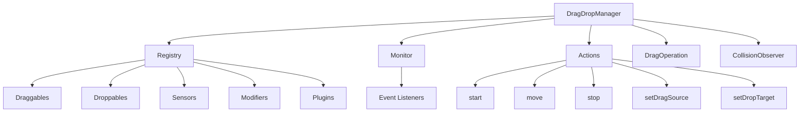

`@dnd-kit/abstract` is the foundational package of dnd-kit that provides a framework-agnostic implementation of drag and drop functionality. It can be used to build drag and drop interfaces in any JavaScript environment.

## Overview

The abstract package provides the core primitives and APIs for:

- **Drag and Drop Management**: Centralized orchestration of drag operations
- **Entities**: Draggable and Droppable primitives for defining interactive elements
- **Sensors**: Pluggable input handlers for mouse, touch, keyboard, and custom interactions
- **Modifiers**: Transform drag behavior with constraints, snapping, and custom logic
- **Plugins**: Extend functionality with reusable, composable behaviors
- **Collision Detection**: Flexible algorithms for determining drop targets
- **Event System**: Comprehensive event lifecycle hooks

## Installation

```bash
npm install @dnd-kit/abstract
```

## Core Exports

### Manager

<Card title="DragDropManager" icon="gear" href="/api/abstract/drag-drop-manager">
  Central orchestrator for all drag and drop operations
</Card>

### Entities

<CardGroup cols={2}>
  <Card title="Draggable" icon="hand" href="/api/abstract/draggable">
    Entities that can be dragged
  </Card>
  <Card title="Droppable" icon="box" href="/api/abstract/droppable">
    Entities that can receive draggables
  </Card>
</CardGroup>

### Extensibility

<CardGroup cols={3}>
  <Card title="Sensors" icon="hand-pointer" href="/api/abstract/sensors">
    Input handlers for drag interactions
  </Card>
  <Card title="Modifiers" icon="sliders" href="/api/abstract/modifiers">
    Transform drag behavior
  </Card>
  <Card title="Plugins" icon="puzzle-piece" href="/api/abstract/plugins">
    Extend drag and drop functionality
  </Card>
</CardGroup>

## Type Definitions

### UniqueIdentifier

Type representing a unique identifier for entities.

```typescript
type UniqueIdentifier = string | number;
```

### Data

Type representing arbitrary data associated with an entity.

```typescript
type Data = Record<string, any>;
```

### Type

Type representing the type/category of an entity.

```typescript
type Type = Symbol | string | number;
```

Used to categorize entities and implement type-based filtering or matching between draggables and droppables.

## Event System

The abstract package provides a comprehensive event system for monitoring drag and drop operations:

### Event Types

<Tabs>
  <Tab title="collision">
    Fired when collisions are detected between draggables and droppables.

    ```typescript
    type CollisionEvent = Preventable<{
      collisions: Collisions;
    }>;
    ```
  </Tab>
  <Tab title="beforedragstart">
    Fired before a drag operation starts. Can be prevented.

    ```typescript
    type BeforeDragStartEvent = Preventable<{
      operation: DragOperationSnapshot;
      nativeEvent?: Event;
    }>;
    ```
  </Tab>
  <Tab title="dragstart">
    Fired when a drag operation starts.

    ```typescript
    type DragStartEvent = {
      operation: DragOperationSnapshot;
      nativeEvent?: Event;
      cancelable: false;
    };
    ```
  </Tab>
  <Tab title="dragmove">
    Fired when the dragged entity moves.

    ```typescript
    type DragMoveEvent = Preventable<{
      operation: DragOperationSnapshot;
      to?: Coordinates;
      by?: Coordinates;
      nativeEvent?: Event;
    }>;
    ```
  </Tab>
  <Tab title="dragover">
    Fired when a draggable hovers over a droppable.

    ```typescript
    type DragOverEvent = Preventable<{
      operation: DragOperationSnapshot;
    }>;
    ```
  </Tab>
  <Tab title="dragend">
    Fired when a drag operation ends.

    ```typescript
    type DragEndEvent = {
      operation: DragOperationSnapshot;
      nativeEvent?: Event;
      canceled: boolean;
      suspend(): {resume(): void; abort(): void};
    };
    ```
  </Tab>
</Tabs>

### Using Events

```typescript
const manager = new DragDropManager();

// Listen to drag start
manager.monitor.addEventListener('dragstart', (event, manager) => {
  console.log('Drag started:', event.operation.source);
});

// Prevent drag move
manager.monitor.addEventListener('dragmove', (event) => {
  if (someCondition) {
    event.preventDefault();
  }
});

// Handle drag end with suspension
manager.monitor.addEventListener('dragend', (event) => {
  if (event.canceled) {
    console.log('Drag was canceled');
  } else {
    // Suspend the operation for async cleanup
    const {resume, abort} = event.suspend();
    
    performAsyncCleanup()
      .then(resume)
      .catch(abort);
  }
});
```

## Collision Detection

The package provides utilities for collision detection:

### CollisionPriority

Priority levels for collision detection.

```typescript
enum CollisionPriority {
  Lowest,
  Low,
  Normal,
  High,
  Highest,
}
```

### CollisionType

Types of collision detection.

```typescript
enum CollisionType {
  Collision,
  ShapeIntersection,
  PointerIntersection,
}
```

### Collision Interface

```typescript
interface Collision {
  id: UniqueIdentifier;        // Droppable identifier
  priority: CollisionPriority | number;
  type: CollisionType;
  value: number;                // Collision strength
  data?: Record<string, any>;   // Additional data
}
```

### CollisionDetector

Function type for custom collision detection.

```typescript
type CollisionDetector = <T extends Draggable, U extends Droppable>(
  input: CollisionDetectorInput<T, U>
) => Collision | null;

interface CollisionDetectorInput<T, U> {
  droppable: U;
  dragOperation: DragOperation<T, U>;
}
```

### sortCollisions

Utility function to sort collisions by priority and value.

```typescript
function sortCollisions(collisions: Collisions): Collisions
```

## Customizable Type

Many configuration options accept a `Customizable` type that allows either a direct value or a function that receives defaults:

```typescript
type Customizable<T> = T | ((defaults: T) => T);
```

### Examples

```typescript
// Direct value (replaces defaults)
const manager = new DragDropManager({
  plugins: [MyPlugin]
});

// Function (receives and extends defaults)
const manager = new DragDropManager({
  plugins: (defaults) => [...defaults, MyPlugin]
});
```

### resolveCustomizable

Utility function to resolve customizable values:

```typescript
function resolveCustomizable<T>(
  value: Customizable<T> | undefined,
  defaults: T
): T
```

## Renderer

Type for handling visual rendering of drag operations.

```typescript
type Renderer = {
  rendering: Promise<void>;
};
```

The renderer's `rendering` promise resolves when the current render cycle is complete, allowing for coordination between drag operations and visual updates.

## Architecture

The abstract package follows a plugin-based architecture:



## Next Steps

<CardGroup cols={2}>
  <Card title="DragDropManager" icon="gear" href="/api/abstract/drag-drop-manager">
    Learn about the central manager API
  </Card>
  <Card title="Draggable" icon="hand" href="/api/abstract/draggable">
    Create draggable entities
  </Card>
  <Card title="Droppable" icon="box" href="/api/abstract/droppable">
    Create droppable entities
  </Card>
  <Card title="Sensors" icon="hand-pointer" href="/api/abstract/sensors">
    Implement input handlers
  </Card>
</CardGroup>
